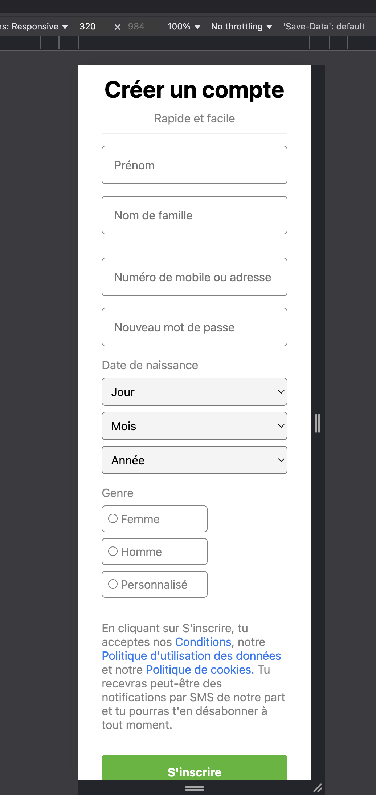
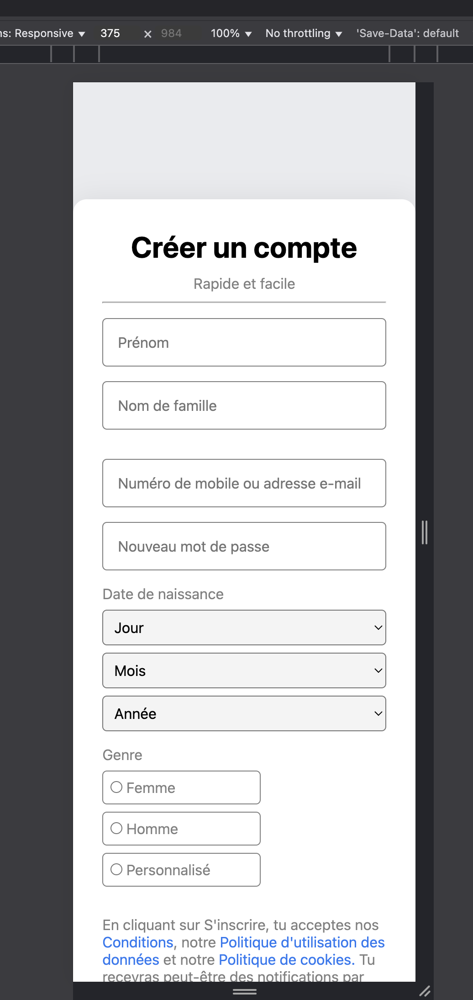
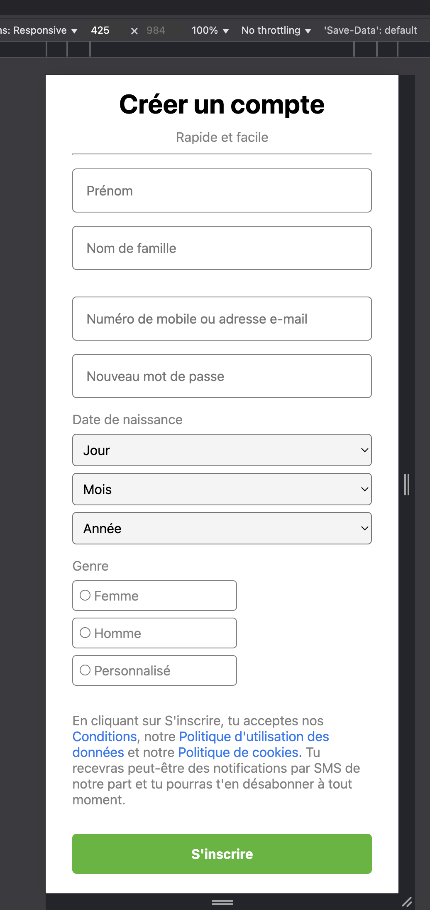
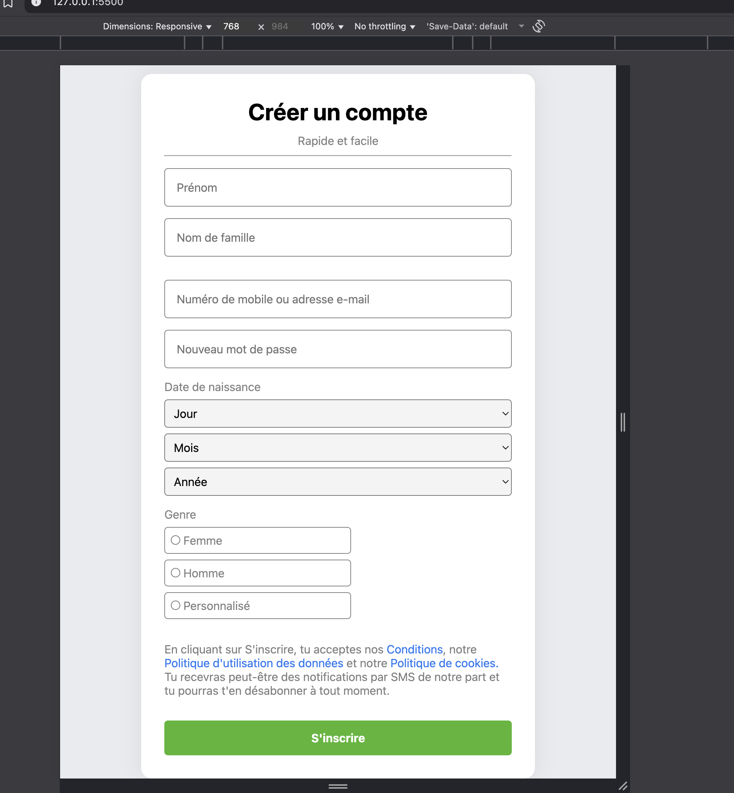
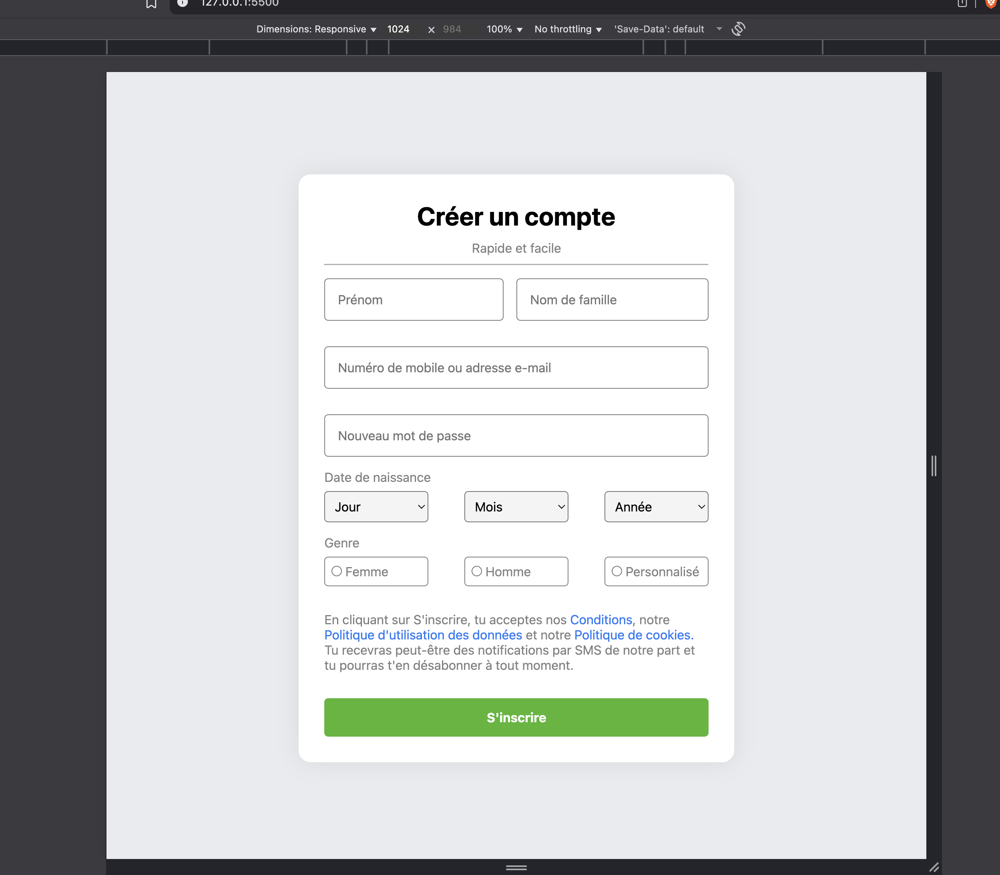
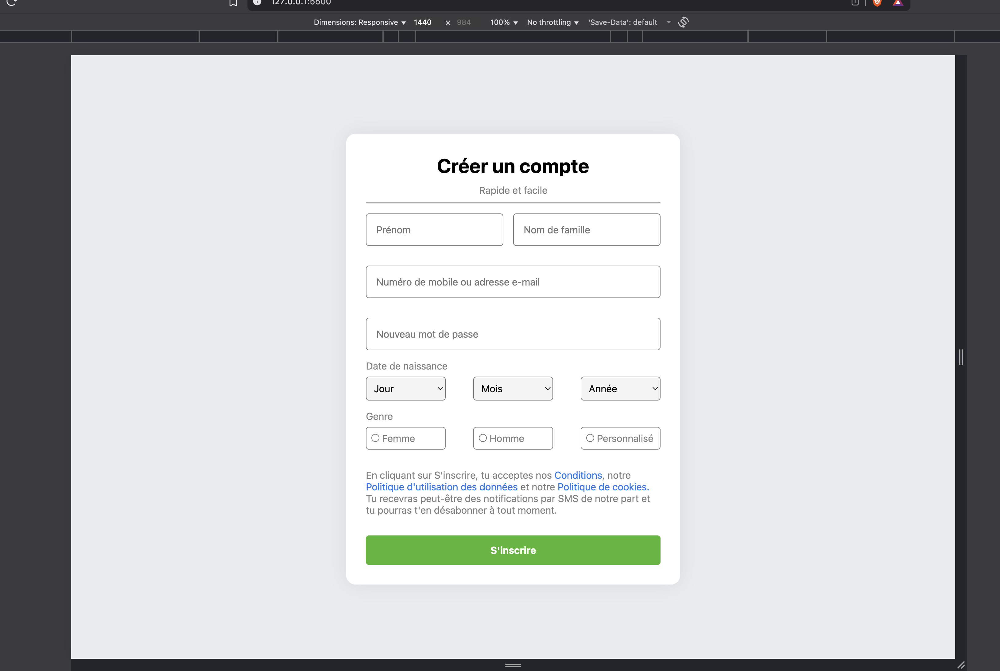

# Objectifs

Ce projet consiste à réaliser une page d'inscription inspirée de Facebook en utilisant uniquement HTML et CSS. L'objectif est de reproduire l'interface utilisateur de la page d'inscription de Facebook, en mettant l'accent sur la structure sémantique, l'accessibilité et le design responsive.

Structuration du formulaire d'inscription avec des champs pour le prénom, le nom, l'email ou le numéro de téléphone, le mot de passe, la date de naissance et le genre.
Respect des bonnes pratiques d'accessibilité (labels, aria-labels, etc.).
Utilisation de styles CSS pour obtenir une interface moderne et agréable à utiliser.
Adaptation de la page pour différents supports (ordinateurs, tablettes, mobiles).
Ajout d'informations légales et de liens vers les conditions d'utilisation, la politique de confidentialité et la politique de cookies.


## Spécifications
 Respect du style guide, Structure HTML sémantique, Formulaire complet & Accessibilité, Design responsive & Propreté du code

## Ma structure

````
body
└── main
    └── form
        ├── section.titre
        │   ├── h1
        │   ├── p
        │   └── hr
        │
        ├── input.prenom
        ├── input.nomfamille
        ├── input.email
        ├── input.motdepasse
        │
        ├── div.date
        │   ├── p
        │   └── div.dates
        │       ├── select (jour)
        │       ├── select (mois)
        │       └── select (year)
        │
        ├── div.genre
        │   ├── p
        │   └── div.genres
        │       ├── div.type
        │       │   ├── input.radio
        │       │   └── label
        │       ├── div.type
        │       │   ├── input.radio
        │       │   └── label
        │       └── div.type
        │           ├── input.radio
        │           └── label
        │
        └── section.fin
            ├── p
            └── button

````
## Les propriétés CSS

Flexbox (body centré)

display: flex → active le modèle flexbox pour aligner les enfants.

justify-content: center → centre horizontalement.

align-items: center → centre verticalement.

background → couleur de fond de la page.

2. Grid (formulaire)

display: grid → organise les éléments en grille.

grid-template-columns: 1fr 1fr → deux colonnes égales.

grid-column: span 2 → un élément occupe les deux colonnes.

padding → espace intérieur autour du contenu.

border-radius → coins arrondis.

box-shadow → ombre pour donner du relief.

3. Espacement et typographie

margin / margin-top / margin-bottom → espace autour des éléments.

line-height → hauteur des lignes pour améliorer la lecture.

text-align → alignement du texte (ex: centré).

4. Boutons

width: 100% / height → taille fixe et largeur complète.

background / color → couleurs contrastées pour visibilité.

border-radius → coins arrondis.

font-weight → gras pour le texte.

5. Champs de formulaire (input, select, radio)

padding → espace intérieur pour confort visuel.

border / border-radius → contour et coins arrondis.

outline → indication visuelle quand le champ est sélectionné.

background-color → pour rendre les champs distincts du fond.

6. Groupes d’éléments (flex interne)

display: flex → alignement horizontal.

justify-content: space-between → espace égal entre les éléments.

7. Liens

color / text-decoration → style visuel des liens.

hover → style au survol (ex: souligné).

8. Responsive (media queries)

@media (max-width: 768px) → applique les styles pour écrans petits.

flex-direction: column → empile les éléments verticalement.

row-gap / width: 100% → adapte l’espacement et la largeur des éléments pour mobiles.

 ### Ecran 320px

 

 ### Ecran 375px

 

 ### Ecran 425px

 

 ### Ecran 768px

 

 ### Ecran 1024px

 

 ### Ecran 1440px

 

 ## GitHub page

 https://oummy100.github.io/facebook-login-page/